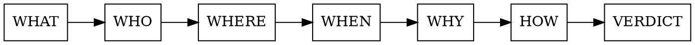

# Hard Code Review: Architect 5W1H

## Overview

Systematic interrogation of code changes via 5W1H framework + sequential reasoning chain. Forces architect-level analysis: not "does this work" but "should this exist, in this form, in this place."

**Core principle:** Answer each question fully before proceeding. Unresolved answer = review blocked at that step.

## When to Use

- PR touches core abstractions, interfaces, or data models
- Change crosses architectural layers or package boundaries
- Performance-sensitive path (zero-alloc codec, hot loop, protocol handler)
- Concurrent code with new synchronization
- Any change where passing tests are necessary but not sufficient

**Skip for:** Typo fixes, doc-only changes, mechanical reformatting.

## Sequential Thinking Chain

Execute steps in order. Each step's output feeds the next. No skipping.



---

### Step 1 — WHAT (Orient)

> What does this code actually do — mechanically?

- Read diff cold, without PR description. State in one sentence what it does.
- Compare to PR description. Divergence = red flag — understand why before continuing.
- List all side effects: I/O, state mutations, goroutine spawns, heap allocations.
- Identify what the code does NOT do (implicit scope boundaries).

---

### Step 2 — WHO (Blast Radius)

> Who calls this? Who fails if this breaks?

- Callgraph up: enumerate all callers, direct and indirect.
- Callgraph down: enumerate all dependencies introduced or changed.
- Which teams / services / systems are affected by a regression here?
- Does failure here fail loudly (panic, error return) or silently (wrong data, dropped frame)?
- Who is responsible for this code going forward?

---

### Step 3 — WHERE (Architectural Fit)

> Does this code belong here?

- Which architectural layer does this live in? Does placement violate layer invariants?
- Does it cross a boundary that should be sealed (e.g., codec layer touching connection state)?
- Does it introduce a new import direction? Is that direction acceptable per the dependency graph?
- Does it duplicate logic that belongs in a different layer or package?
- Would a future reader know WHY it lives here?

---

### Step 4 — WHEN (Lifecycle & Timing)

> When does this execute? Under what conditions?

- Execution phase: startup / steady-state / teardown / error / shutdown?
- Call frequency: hot path (every frame) or cold path (once per connection)?
- Concurrent access: which goroutines touch this? What synchronization guards it?
- What invariants does this code ASSUME hold when it runs?
- What happens on: context cancellation, timeout, partial write, peer disconnect?

---

### Step 5 — WHY (Justification)

> Why this approach? What alternatives exist?

- Could this be simpler? (Simpler = fewer moving parts, not fewer lines.)
- What assumption is being encoded here? Is it documented?
- Why not extend or reuse an existing abstraction?
- If this is a workaround: why not fix the root cause instead?
- Is the RFC or spec section cited where protocol behavior is being implemented?

---

### Step 6 — HOW (Mechanism Audit)

> Does the implementation correctly realize the design?

- **Alloc profile:** allocates where zero-alloc is required? Check benchmem.
- **Error handling:** every error path explicit? No silent drops?
- **Locking:** correct acquisition order? Lock held across I/O? Double-lock risk?
- **Goroutines:** lifecycle documented? Can they leak? Context propagated?
- **Protocol:** RFC section cited in test? Edge cases (RST, GOAWAY, flow control exhaustion) covered?
- **Tests:** is there a test that would FAIL if this change were reverted?

---

## Verdict Structure

After all 6 steps, emit this block verbatim:

```
ARCHITECT REVIEW — <file or component>
=======================================
WHAT:    <one-line mechanical description>
BLAST:   <affected callers + failure mode>
FIT:     PASS | VIOLATION: <reason>
TIMING:  <hot/cold, concurrent risk if any>
WHY:     STRONG | WEAK | MISSING — <one sentence>
HOW:     alloc <OK|REGRESSION> · lock <OK|RACE> · errors <OK|SWALLOWED> · tests <OK|MISSING>

VERDICT: APPROVE | REQUEST CHANGES | BLOCK

BLOCKING ISSUES:
  1. <issue> [WHAT/WHO/WHERE/WHEN/WHY/HOW]
  (or "none")

NON-BLOCKING:
  1. <suggestion>
  (or "none")
```

VERDICT definitions:
- **APPROVE** — no blocking issues; non-blocking items are optional
- **REQUEST CHANGES** — blocking issues exist but are fixable without redesign
- **BLOCK** — fundamental architectural violation; needs redesign before review continues

---

## Architectural Fitness Functions

Auto-check these on every review. Failure = BLOCK.

| Fitness Function | How to Verify |
|------------------|---------------|
| Zero-alloc codec | `go test -benchmem ./frame/... ./hpack/...` → 0 B/op, 0 allocs/op |
| No import cycles | `go list -f '{{.ImportPath}} → {{.Imports}}' ./...` clean |
| Layer isolation | `frame`, `hpack` import nothing from `conn` |
| Concurrency safety | `go test -race ./...` passes |
| RFC conformance | `TestConformance_RFC7540_*` / `TestConformance_RFC7541_*` present and green |
| Doc comment coverage | `golangci-lint run` (revive) passes on all exported symbols |
| RFC trace | New conformance test row added to `docs/RFC_COVERAGE.md` |

---

## Instant BLOCK Triggers

Stop review and emit BLOCK immediately on any of:

- New mutex acquired without documented lock ordering
- `interface{}` / `any` in hot path (implicit alloc)
- `panic` in library code (non-`main`)
- Error discarded with `_` on non-trivial operation
- Exported type/func/const without doc comment
- Goroutine spawned without documented lifetime or cancellation path
- Cross-layer import violating architecture diagram
- Test added AFTER implementation was written (TDD violated — proves implementation drives tests, not spec)

---

## Common Weak Justifications — Challenge Table

| Claim | Architect's Challenge |
|-------|-----------------------|
| "It works" | Prove it: benchmarks + race detector + protocol edge cases. |
| "Simple change" | Simple changes break invariants. Walk the blast radius first. |
| "Similar to existing pattern" | Show the pattern. Is the existing pattern correct? |
| "Will refactor later" | Name the ticket. What debt is being accepted right now? |
| "No test needed, it's obvious" | Obvious = 5 minutes to write the test. Write it. |
| "RFC says so" | Cite the section. Show the test named `TestConformance_RFC754x_SecXX_*`. |
| "Low risk, it's just a flag" | Flags change behavior under concurrency. WHEN analysis required. |

---

## Example: Full Review

```
ARCHITECT REVIEW — conn/flowcontrol.go: retroactive INITIAL_WINDOW_SIZE resize
================================================================================
WHAT:    On SETTINGS ACK, applies delta to all open streams' send windows.
BLAST:   All open streams at resize moment; overflow past 2^31-1 → ConnError.
         Silent path: streams near limit get negative window (blocked writes).
FIT:     PASS — correctly scoped to conn layer; no cross-layer violations.
TIMING:  Cold path (settings ACK), but mutates O(n streams) under psMu+stream.mu.
         Lock held O(n): acceptable at current scale; note for pool with 1000+ conns.
WHY:     STRONG — RFC §6.9.2 mandates retroactive application; no alternative.
HOW:     alloc OK · lock OK (order: psMu→stream.mu, documented in CLAUDE.md) ·
         errors OK (overflow returns typed ConnError, not panic) ·
         tests OK (TestConformance_RFC7540_Sec6_9_2_RetroactiveResize covers it)

VERDICT: APPROVE

BLOCKING ISSUES:
  none

NON-BLOCKING:
  1. Add benchmark at 1000 open streams to gate O(n) resize cost before Phase C pool lands.
```

---

## Quick Reference

| Step | Core Question | Blocker Signal |
|------|---------------|----------------|
| WHAT | Mechanical behavior | PR desc ≠ actual behavior |
| WHO | Blast radius | Silent failure, unknown callers |
| WHERE | Layer placement | Cross-layer import, wrong package |
| WHEN | Execution context | Concurrent without guard, hot path allocs |
| WHY | Design justification | No RFC cite, no alternative considered |
| HOW | Implementation correctness | Alloc regression, lock order, missing test |
